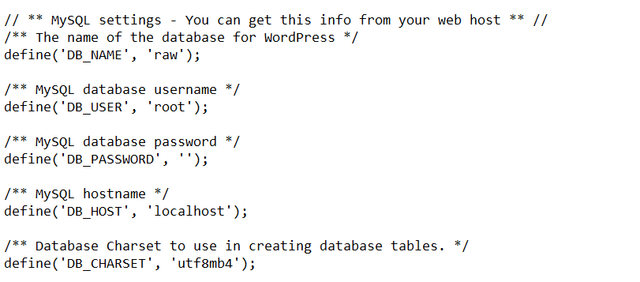
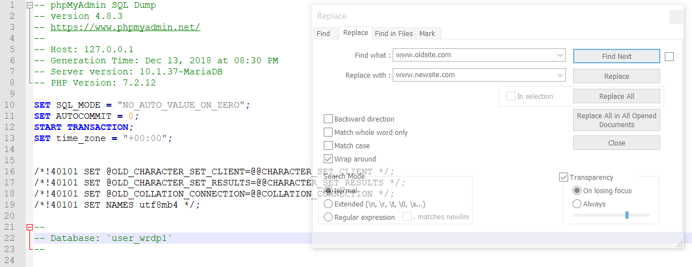

# Migrate, Copy, Or Clone A WordPress Website

## How to move your site from one server to another.

## Description
  This lesson will look at how to migrate, copy, or clone a WordPress website by using an FTP client, phpMyAdmin, and a text editor.

## Objectives

  *   Learn how to migrate, copy, or clone a website from one location to another.
  *   Migrate a site without losing any data or settings.

## Target Audience
* [x] Users
* [ ] Designers
* [x] Developers
* [ ] Speakers
* [ ] All

## Experience Level

* [ ] Beginner
* [x] Intermediate
* [ ] Advanced
* [ ] Any

## Type of Instruction

* [x] Demonstration
* [ ] Discussion
* [x] Exercises
* [ ] Feedback
* [ ] Lecture (Presentation)
* [ ] Show & Tell
* [ ] Tutorial

## Time Estimate (Duration)

  20 minutes

## Prerequisite Skills

*   Basic cPanel/Plesk knowledge
*   Familiarity with an FTP Client

## Readiness Questions

*   Are you looking to move a current WordPress site to a new hosting provider or location?
*   Do you want complete control over the migration process?

## Materials Needed

  * An old WordPress site and a new WordPress site
  * An FTP client
  * A text editor with find and replace functionality

## Notes for the Instructor

*   It's recommended that you show all of the steps in a live server environment as opposed to using " MAMP, XAMPP, or WAMP ". This is due to an FTP client being required to handle WordPress databases.

## Lesson Outline

  * Discuss why someone may want to migrate their site (e.g., problems with a hosting provider or they have changed their URL.)
  * Introduce the materials required for this lesson.
  * Demonstrate how to migrate a site using live server environments.
  * Allow the students to migrate a site of their own to practice the process.

## Exercises

### Finding Your WordPress Site's Database Name
*   Start your FTP client and navigate to your WordPress root directory.
*   Open the **wp-config.php** file with a text editor.
*   Search for the line **define(‘DB_NAME, ‘[Your Database]’)**. The second part is your database name.

### Exporting Your Old Site’s Database
* Log in to phpMyAdmin through your hosting provider.
* Select your WordPress database by clicking it on the left-hand panel.
* Locate the export button and click it.
* Make sure that SQL is selected as your format and click go.

### Setup and Install WordPress on Your New site
* Download the latest version of WordPress from WordPress.org.
* Open your FTP client and navigate to your new site's root directory. This is usually known as **/public_html/**.
* Unzip the file you downloaded from WordPress and upload to this location.
* To keep your themes, plugins, and more, you'll want to upload your old **wp-content** folder.
* Navigate to your old WordPress site's root folder with your FTP client and find the **wp-content** folder. Download this folder.
* Navigate back to the new WordPress site's WordPress directory. Upload the folder here, overwriting anything that already exists.

### Update for a New URL (If You're Changing URL)
* Create a backup of the .sql file you exported earlier.
* Open the original .sql file with a text editor.
* Open the find and replace function.
* Search for all instances of your old site's URL and replace with the new site's URL. Make sure to include www. in your search.

### Upload Your WordPress Site's Database to Your New Site
* Login to your new site's phpMyAdmin.
* Select the new site's WordPress database on the left-hand side.
* Check all of the databases that appear in the main panel and click drop.
* Click Import, click Choose File, locate your .sql file, and upload it.

### Make Sure Your Database Prefix Is Correct
* Open your wp-config.php file on your new site.
* Navigate to the line that says **table_prefix =''**.
* Make sure that your table prefix is correct.

## Example lesson

### Introduction
Moving a WordPress website can be a long and complicated process, but it doesn't have to be. You can manage moving a WordPress website yourself with a simple understanding of FTP, your hosting control panel, and some text edits.

Moving your website yourself gives you a lot more control over the migration process and allows you to create local backups as you go. It also allows you to select which features you want to migrate and which you want to leave behind.

### Why Might You Want to Move a WordPress Site?
You may want to migrate your WordPress website due to having a slow hosting provider or issues with your current WordPress environment. Other reasons for migrating your WordPress site may be upgrading your hosting package, or looking to change your URL.

Many hosting providers will handle migration for you. However, if you're running on more of a sandbox style hosting environment, or you're just looking to have complete control over the process, you may want to manage it yourself.

See if students can come up with their own reasons for migrating their WordPress site. Perhaps they have experienced problems in the past and considered moving their website to another location. Ask students when it is a good idea to move a site and when it isn't worth it. Walk through the problems and fears associated with moving a website.

### Introducing the Tools For Migration

There are many ways to migrate a site yourself. There are multiple plugins available that will handle most of the process for you. This includes:

*   WordPress Duplicator
*   WordPress Move
*   BackupBuddy
*   WP Migrate DB Pro
*   myEASYbackup
*   UpdraftPlus
*   WP Clone by WP Academy
*   All-in-One WP Migration
*   ManageWP

This guide will cover migration by using FTP. You will need a basic understanding of how to use an FTP client, along with a text editor capable of find and replace.

Ask students what they have used FTP for in the past and how much experience they have with it. Cover the WordPress root directory structure and how to navigate their WordPress site through FTP.

## Lesson Wrap Up
Follow the exercises above and have the students practice the exercises themselves. 
