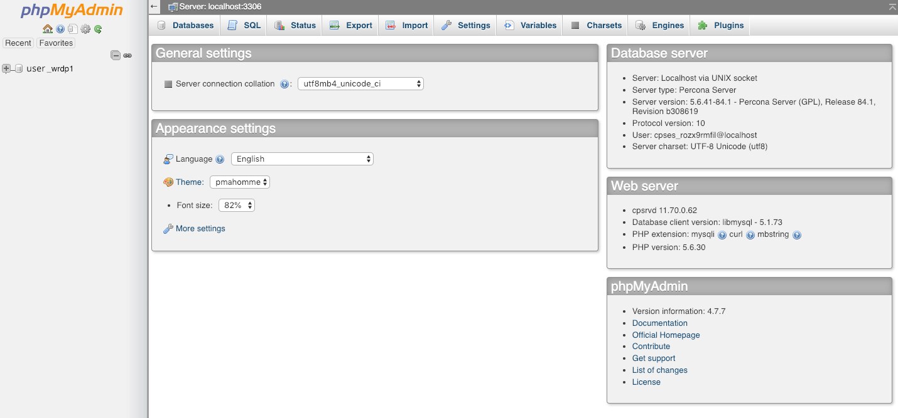

# Migrate, Copy, Or Clone A WordPress Website

## How to move your site from one server to another.

## Description
  This lesson will look at how to migrate, copy, or clone a WordPress website by using an FTP client, phpMyAdmin, and a text editor.

## Objectives

  *   Learn how to migrate, copy, or clone a website from one location to another.
  *   Migrate a site without losing any data or settings.

## Prerequisite Skills

*   Basic cPanel/Plesk knowledge
*   Familiarity with an FTP Client

## Teacher Notes

*   It's recommended that you show all of the steps on the live server rather than using " MAMP, XAMPP, WAMP " since an FTP client is required to handle the database.

## Hands-on Walkthrough

### First Things First: You Need Your Old Site’s Database

To export your old site’s WordPress database, you will need to head into the PHPMyAdmin section of your hosting provider. Accessing PHPMyAdmin is different with every hosting provider, so we won’t be covering that here. Google your provider's name and “PHPMyAdmin”, and you'll hopefully find some documentation.

Once you are logged into PHPMyAdmin, you should see something that resembles the screenshot above (older versions of PHPMyAdmin might look slightly different but the principles here are the same).

 From here, you will need to select the correct database to export. If you do not know the correct database name, you can find it out from the wp-config.php file on your old WordPress website. 

### Finding Your Database Name

Open the wp-config.php with your FTP client of choice. Then search for a line similar to define(‘DB_name, ‘YOURDATABASENAMEISHERE’). The second value is your database name.

 

Once you know the Database name, you can then return to PHPMyAdmin and open it from the left-hand panel. From here, You will see all the tables containing all of the data on your WordPress site. Go ahead and click export at the top and save it as an SQL file.

### Setup and Install WordPress on the new site

Many hosting providers will auto install WordPress during their setup process. If your provider doesn't, you can also do this manually by downloading the latest version of WordPress from [WordPress.org](wordpress.org).

Open your FTP client of choice and navigate to your Website's root directory. This is usually known as /public_html/. Unzip the file from WordPress.org and upload it to this location. You now have a fresh WordPress install on your website.

To keep all your themes, plugins and uploads, you'll also want to move your wp-content folder to your new site. To do this, you will once again want to open your FTP Client and navigate to the root directory of your old WordPress site. In here, you'll find your wp-content folder. Download it.

Switch your FTP client to your new site and navigate to the same WordPress root directory. Once opened, you can then upload your wp-content folder, overwriting any existing data.

 

### Find and Replace in Your old site’s database

This step is designed to help to repurpose your existing MySQL database for a new URL, and can be skipped if you are simply migrating the site: i.e. If the URL is staying the same and you are just changing the server or hosting provider.

This step involves editing the .sql file you exported in the first step. You'll want to open this with a text editor. Notepad++ on Windows or TextWrangler on Mac are good options, but it doesn't matter what you use as it has found and replace functionality.

As with anything you make changes to, be sure to create a backup before proceeding. Then find and replace all instances of your old URL with that of a new one. For instance, if your old site is www.oldsite.com, search for these instances and replace with www.newsite.com.

Make sure that you include www. in your find and replace operation, or you can end up causing problems with your admin email being updated. If you find that you've completed this step incorrectly, and are not sure why, you can easily restore your backup.

 
### Clear out the new WordPress installs Database and Import the old

By now you should have edited the old MySQL database and updated the URLs to fit the new destination site. You should also have installed a fresh version of WordPress for the new site and uploaded your existing wp-content folder to your new WordPress site.

At this point, you're ready to import your WordPress database. Log into your new site's phpMyAdmin interface and click into the WordPress database on the left-hand panel. This should have a different name than your old site's database. Once you've open this database, check all of the tables available and click drop and confirm.

After dropping the database, head back to the top of the page and this time click import. Locate your .sql file and upload it. Please note that some servers are do not allow large database uploads, so you may need to create a .zip before uploading.

### Editing wp-config.php

When you are done make sure that the database prefix is the same in wp-config.php and inside your PHP MyAdmin. If that is not the case, just simply edit the line i.e: `$table_prefix = 'wp_'; // Only numbers, letters, and underscores please! $table_prefix = 'y77_'; // Only numbers, letters, and underscores please!` Your website should be cloned correctly and it should look like an exact clone of the source one. Don’t forget that the different PHP and MySQL versions could cause issues in the proper functioning of the new website but mostly in the case when the versions are lower on a destination than on the source server. There are also a lot of plugins and SaaS that can help in making this job easier.

*   WordPress Duplicator
*   WordPress Move
*   BackupBuddy
*   WP Migrate DB Pro
*   myEASYbackup
*   UpdraftPlus
*   WP Clone by WP Academy
*   All-in-One WP Migration
*   ManageWP
